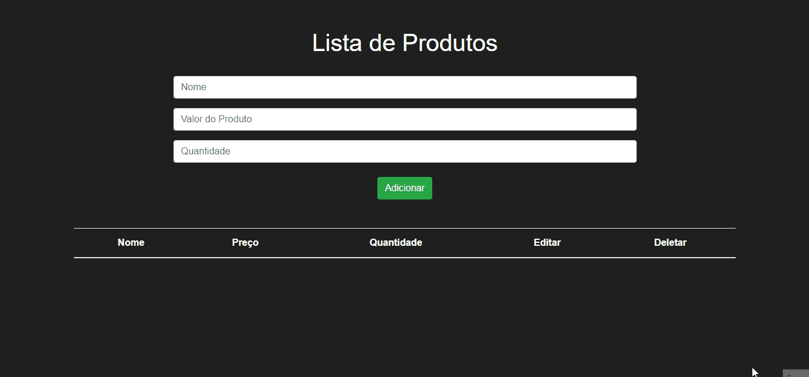

  <a href="#-tecnologias">Tecnologias</a>&nbsp;&nbsp;&nbsp;|&nbsp;&nbsp;&nbsp;
  <a href="#-projeto">Projeto</a>&nbsp;&nbsp;&nbsp;|&nbsp;&nbsp;&nbsp;

 

  

 

## 🚀 Tecnologias

Esse projeto está sendo desenvolvido com as seguintes tecnologias:

- HTML5
- CSS3
- JavaScript
- ReactJs
- NodeJs
- Express
- PostgreSQL
- Cors

 

## 💻 Projeto

O projeto é um sistema de CRUD para gerenciamento de produtos, contendo informações como nome, preço e quantidade em estoque.

Para roda o projeto basta instalar as dependências com o 'npm install' tanto na pasta do server quanto no client. depois rodar o server com 'node index' e o client com 'npm start'

---

Feito com ♥ by Banzak